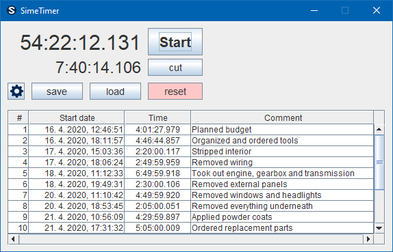
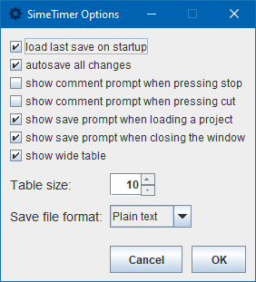
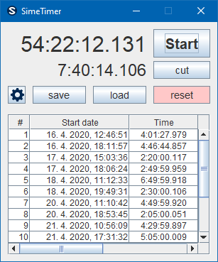

# SimeTimer

A tabular stopwatch for small and large scale timekeeping

You can use SimeTimer for millisecond-scale timing, just as well as for large-scale projects.
For each time chunk, you can set a description of what you did in that time.

The window size, saving behaviour, and other settings are customizable, see below:

### Customizable options

### Compact view

